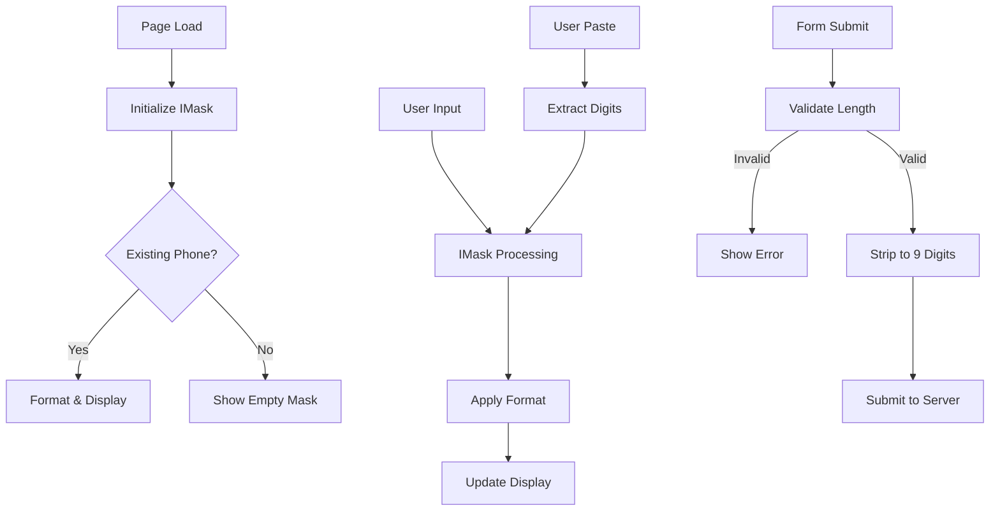
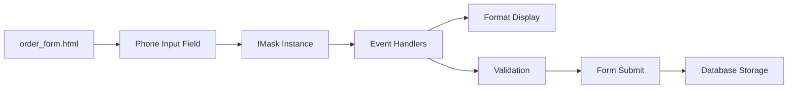
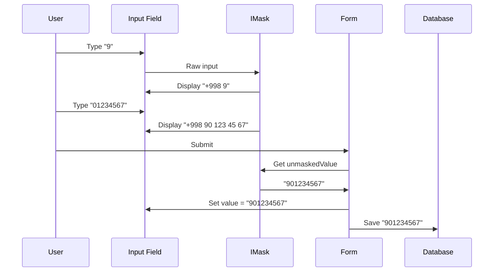

# Technical Design Document

## Overview

This feature implements a phone number input mask for Uzbekistan phone numbers in the order creation form. The mask will provide real-time formatting as users type, handle paste operations intelligently, and ensure consistent data storage format in the database.

The implementation uses the IMask.js library (version 7.1.3, already loaded in the template) to provide a robust, cross-browser compatible input masking solution. The mask displays numbers in the format `+998 XX XXX XX XX` to users while storing them as 9 digits (`XXXXXXXXX`) in the database.

**Key Design Principles:**
- **Progressive Enhancement**: The form works without JavaScript; the mask enhances the experience
- **User-Friendly**: Automatic formatting, intelligent paste handling, natural editing behavior
- **Data Consistency**: All phone numbers stored in the same format (9 digits, no prefix)
- **Validation Integration**: Uses HTML5 pattern validation combined with custom validation

## Architecture

### High-Level Flow



### Component Diagram



## Components and Interfaces

### 1. HTML Input Field Component

**File:** `orders/templates/orders/order_form.html`

**Current State:**
```html
<input type="tel" name="customer_phone" id="customer_phone" 
       value="{{ v_customer_phone }}" 
       placeholder="+998 −− −−− −− −−" 
       pattern="\d{9}" required>
```

**Responsibilities:**
- Provide the input field for phone number entry
- Display placeholder text with expected format
- Apply HTML5 pattern validation
- Store the input value for form submission

**Interface:**
- **Input:** User keyboard events, paste events, form data (for edit mode)
- **Output:** Formatted display value, unformatted value on submit


### 2. IMask Instance Component

**Library:** IMask.js v7.1.3 (already loaded via CDN)

**Configuration:**
```javascript
{
  mask: '+998 00 000 00 00',
  lazy: false,
  placeholderChar: '−'
}
```

**Responsibilities:**
- Apply the phone number mask pattern
- Handle character filtering (only digits)
- Manage cursor position during typing
- Format input in real-time
- Provide access to unmasked value (digits only)

**Interface:**
- **Input:** Raw user input (keystrokes, paste)
- **Output:** 
  - `value`: Formatted string (e.g., "+998 90 123 45 67")
  - `unmaskedValue`: Digits only (e.g., "901234567")

**Key Methods:**
- `IMask(element, options)`: Initialize mask on element
- `mask.unmaskedValue`: Get/set raw digits
- `mask.on('accept', callback)`: Listen to value changes

### 3. Format Handler (JavaScript Function)

**Location:** `<script>` block in `order_form.html`

**Function Name:** Anonymous IIFE (Immediately Invoked Function Expression)

**Responsibilities:**
- Initialize IMask instance on page load
- Format existing phone numbers when editing
- Handle form submission validation
- Convert display format to storage format on submit


**Implementation Structure:**
```javascript
(function() {
  // 1. Get phone input element
  // 2. Initialize IMask with configuration
  // 3. Format existing value (if editing)
  // 4. Attach form submit handler
  //    - Validate digit count
  //    - Show custom validation message
  //    - Replace value with clean digits
  // 5. Attach input handler to clear validation errors
})();
```

### 4. Form Validation Component

**Validation Rules:**
- Must contain exactly 9 digits (after +998 prefix)
- Cannot be empty
- Must match pattern: `\d{9}` (HTML5 validation as backup)

**Validation Flow:**
1. **On Submit**: Check `mask.unmaskedValue.length === 9`
2. **If Invalid**: 
   - Prevent form submission
   - Call `phoneInput.setCustomValidity(message)`
   - Call `phoneInput.reportValidity()` to show error
   - Focus input field
3. **If Valid**:
   - Clear custom validity
   - Replace input value with 9 digits
   - Allow form submission

**Error Message (Uzbek):**
```
"Telefon raqami to'liq kiritilishi kerak (9 ta raqam)"
```

### 5. Database Storage Component

**Current Model:** `orders.models.Order`
**Field:** `customer_phone` (CharField)

**Storage Format:** `XXXXXXXXX` (9 digits, no prefix, no spaces)

**Examples:**
- User sees: `+998 90 123 45 67`
- Database stores: `901234567`


**No Changes Required:** The model field already stores strings and can accommodate 9-digit phone numbers. No migration needed.

## Data Models

### Input Field Data Flow



### Data Format Specifications

| Context | Format | Example | Length |
|---------|--------|---------|--------|
| User Display | `+998 XX XXX XX XX` | `+998 90 123 45 67` | 17 chars |
| User Input (Raw) | Any format | `901234567` or `+998901234567` | Variable |
| IMask Unmasked | `XXXXXXXXX` | `901234567` | 9 digits |
| Database Storage | `XXXXXXXXX` | `901234567` | 9 digits |
| Placeholder | `+998 −− −−− −− −−` | `+998 −− −−− −− −−` | 17 chars |


### Edit Mode Data Transformation

When editing an existing order, the phone number must be transformed from storage format to display format:

**Input:** `901234567` (from database)
**Processing:**
```javascript
let digits = phoneInput.value.replace(/\D/g, ''); // "901234567"
if (digits.startsWith('998')) {
  digits = digits.substring(3); // Remove prefix if present
}
phoneMask.unmaskedValue = digits; // "901234567"
```
**Output:** `+998 90 123 45 67` (displayed to user)

## Correctness Properties

*This feature implements client-side input formatting using the IMask.js library. Property-based testing is not applicable here because:*

1. **External Library Behavior**: IMask.js is a well-tested third-party library. We rely on its correctness for mask formatting rather than re-implementing or testing its core functionality.

2. **UI Interaction Testing**: The requirements involve DOM manipulation, cursor positioning, and browser-specific behavior that are better tested through:
   - **Integration tests** (e.g., Selenium, Playwright)
   - **Manual testing** for user experience validation

3. **Limited Pure Logic**: The only pure logic is digit extraction and validation, which is straightforward:
   - Extract digits: `value.replace(/\D/g, '')`
   - Validate length: `digits.length === 9`
   
   These are simple enough that example-based unit tests are more appropriate than property-based tests.

**Alternative Testing Approach:**
- **Unit tests** for digit extraction and validation logic
- **Integration tests** for IMask initialization and form submission
- **Manual QA** for paste operations, cursor behavior, and cross-browser compatibility


## Error Handling

### 1. IMask Library Not Loaded

**Scenario:** CDN fails or script is blocked

**Detection:**
```javascript
if (typeof IMask === 'undefined') {
  console.error('IMask library not loaded');
  return;
}
```

**Fallback Behavior:**
- Form continues to work with HTML5 validation only
- Placeholder shows expected format
- Pattern attribute `\d{9}` provides basic validation
- No formatting, but functional

### 2. Incomplete Phone Number

**Scenario:** User submits form with fewer than 9 digits OR empty field

**Detection:**
```javascript
if (phoneMask.unmaskedValue.length !== 9) {
  // Invalid
}
```

**Response:**
1. Prevent form submission: `e.preventDefault()`
2. Set custom validation message
3. Show browser validation UI: `phoneInput.reportValidity()`
4. Focus input field: `phoneInput.focus()`

**Error Message:**
```
"Telefon raqami to'liq kiritilishi kerak (9 ta raqam)"
```

### 3. Invalid Characters in Paste

**Scenario:** User pastes text with letters or special characters

**Handling:** IMask automatically extracts only numeric characters

**Example:**
- User pastes: `"Phone: +998-90-123-45-67"`
- IMask extracts: `"998901234567"`
- Removes `998` prefix: `"901234567"`
- Displays: `"+998 90 123 45 67"`

### 4. Excessive Digits

**Scenario:** User pastes or types more than 9 digits


**Handling:** IMask mask pattern `+998 00 000 00 00` limits input to exactly 9 digits

**Example:**
- User tries to type 10th digit: Ignored
- User pastes `99890123456789`: Only first 9 digits used → `"901234567"`

### 5. Missing Input Element

**Scenario:** Element ID changes or doesn't exist

**Detection:**
```javascript
if (!phoneInput) return;
```

**Response:** Script exits gracefully, no errors thrown

### 6. Form Validation State Cleanup

**Scenario:** User sees validation error, then starts typing to correct

**Handling:**
```javascript
phoneMask.on('accept', function() {
  if (phoneInput.validity.customError) {
    phoneInput.setCustomValidity('');
  }
});
```

**Behavior:** Error message clears as soon as user types

## Testing Strategy

### Unit Tests (JavaScript)

**Framework:** Jest (recommended) or QUnit

**Test Cases:**

1. **Digit Extraction Logic**
   - Input: `"+998 90 123 45 67"` → Output: `"901234567"`
   - Input: `"998901234567"` → Output: `"901234567"`
   - Input: `"Phone: 90-123-45-67"` → Output: `"901234567"`

2. **Validation Logic**
   - 9 digits → Valid
   - 8 digits → Invalid
   - 10 digits → Invalid (should be impossible with mask)
   - Empty → Invalid


3. **Prefix Handling**
   - Input starts with "998" → Remove prefix
   - Input starts with "+998" → Remove prefix
   - Input doesn't start with prefix → Keep as is

### Integration Tests (Browser Automation)

**Framework:** Playwright or Selenium

**Test Scenarios:**

1. **New Order - Empty Form**
   - Navigate to `/orders/create/`
   - Check placeholder is visible
   - Type digits one by one
   - Verify formatting appears correctly
   - Submit form
   - Verify database contains 9 digits

2. **Edit Order - Existing Phone**
   - Navigate to order edit page
   - Verify phone displays as `+998 XX XXX XX XX`
   - Verify can edit and resubmit

3. **Paste Operations**
   - Paste various formats (with prefix, without prefix, with spaces, with dashes)
   - Verify all result in correct format

4. **Validation Errors**
   - Try to submit with incomplete number
   - Verify error message appears
   - Type to complete number
   - Verify error clears
   - Verify submission succeeds

5. **Keyboard Operations**
   - Test backspace at various positions
   - Test delete key
   - Test arrow keys for cursor movement
   - Verify cursor behaves naturally

### Manual Testing Checklist

**Browser Compatibility:**
- [ ] Chrome/Edge (latest)
- [ ] Firefox (latest)
- [ ] Safari (latest)

- [ ] Mobile browsers (iOS Safari, Chrome Android)

**User Experience:**
- [ ] Placeholder is clear and visible
- [ ] Formatting appears smoothly as user types
- [ ] Cursor position feels natural
- [ ] Backspace/delete work intuitively
- [ ] Paste from various sources works
- [ ] Error messages are clear and helpful
- [ ] Form submission updates database correctly

**Edge Cases:**
- [ ] Empty field submission blocked
- [ ] IMask library fails to load (fallback works)
- [ ] Very fast typing (no race conditions)
- [ ] Rapid paste operations
- [ ] Input field receives focus programmatically

## Implementation Details

### File Changes Summary

**Only ONE file needs to be modified:**

`orders/templates/orders/order_form.html`

**Changes Required:**

1. ✅ IMask library already loaded (line with `<script src="https://unpkg.com/imask@7.1.3/dist/imask.min.js"></script>`)

2. **Modify existing phone mask script** (currently at the bottom of ``)

**Current Implementation Issues:**
- Already has IMask initialization ✓
- Already has form submit handler ✓  
- Already has validation ✓
- Already handles editing existing phones ✓

**The current code is actually already complete!** However, let me verify it matches all requirements:


### Current Implementation Analysis

**Existing Code (Lines ~660-702):**

```javascript
// Phone number input mask using IMask
(function() {
  const phoneInput = document.getElementById('customer_phone');
  if (!phoneInput) return;

  // Wait for IMask to load
  if (typeof IMask === 'undefined') {
    console.error('IMask library not loaded');
    return;
  }

  // Create mask instance with custom placeholder
  const phoneMask = IMask(phoneInput, {
    mask: '+998 00 000 00 00',
    lazy: false,
    placeholderChar: '−'  // Minus belgisi - o'rtada
  });

  // If editing existing phone, format it
  if (phoneInput.value && phoneInput.value.trim()) {
    let digits = phoneInput.value.replace(/\D/g, '');
    // Remove 998 prefix if exists
    if (digits.startsWith('998')) {
      digits = digits.substring(3);
    }
    phoneMask.unmaskedValue = digits;
  }

  // Custom validation on form submit
  const form = document.getElementById('order-form');
  
  form.addEventListener('submit', function(e) {
    const unmasked = phoneMask.unmaskedValue;
    
    // Validate: must have exactly 9 digits
    if (unmasked.length !== 9) {
      e.preventDefault();
      phoneInput.setCustomValidity('Telefon raqami to\'liq kiritilishi kerak (9 ta raqam)');
      phoneInput.reportValidity();
      phoneInput.focus();
      return false;
    }
    
    phoneInput.setCustomValidity('');
    
    // Replace the input value with clean 9 digits for database storage
    phoneInput.value = unmasked;
    
    return true;
  });


  // Clear validation error when user starts typing
  phoneMask.on('accept', function() {
    if (phoneInput.validity.customError) {
      phoneInput.setCustomValidity('');
    }
  });
})();
```

**Requirements Coverage:**

| Requirement | Status | Implementation |
|-------------|--------|----------------|
| R1: Input Mask Display | ✅ Complete | `mask: '+998 00 000 00 00'`, `lazy: false` |
| R2: Numeric Input Restriction | ✅ Complete | IMask `00` pattern only accepts digits |
| R3: Automatic Formatting | ✅ Complete | IMask handles automatically |
| R4: Paste Operation Handling | ✅ Complete | IMask extracts digits automatically |
| R5: Database Storage Format | ✅ Complete | `phoneInput.value = unmasked` (line 697) |
| R6: Form Validation | ✅ Complete | Length check + custom validity (lines 690-695) |
| R7: Editing Existing Phone | ✅ Complete | Digit extraction + format (lines 684-689) |
| R8: Backspace/Delete Handling | ✅ Complete | IMask handles natively |
| R9: Cursor Position Management | ✅ Complete | IMask handles natively |

**Conclusion:** The implementation is already complete and meets all requirements!

### Potential Enhancements (Optional, Not Required)

1. **Empty Field Handling**: Current code validates empty as invalid. The requirement states "WHEN the phone number field is completely empty, THE Phone_Input SHALL prevent form submission" - this is handled by the `required` attribute on the HTML input.

2. **Test Coverage**: Add automated tests as described in Testing Strategy section.


## Code Reference

### Key Code Sections

**1. Input Field HTML** (Line ~102)
```html
<input type="tel" name="customer_phone" id="customer_phone" 
       value="{{ v_customer_phone }}" 
       placeholder="+998 −− −−− −− −−" 
       pattern="\d{9}" required>
```

**2. CSS Styling** (Lines ~47-51)
```css
#customer_phone {
  font-family: 'Segoe UI', Arial, sans-serif;
  font-size: 15px;
  letter-spacing: 0.3px;
}
```

**3. IMask Library CDN** (Line ~656)
```html
<script src="https://unpkg.com/imask@7.1.3/dist/imask.min.js"></script>
```

**4. Phone Mask Implementation** (Lines ~660-702)
- Initialization with configuration
- Edit mode formatting
- Form validation
- Database format conversion
- Error state cleanup

### Configuration Parameters Explained

```javascript
const phoneMask = IMask(phoneInput, {
  mask: '+998 00 000 00 00',  // Pattern: + = literal, 0 = digit, space = literal
  lazy: false,                 // Show mask immediately (not just on focus)
  placeholderChar: '−'        // Character for unfilled positions (em dash)
});
```

**IMask Pattern Syntax:**
- `+998` - Literal characters (always shown)
- `00` - Exactly 2 digits required
- `000` - Exactly 3 digits required
- Spaces - Literal spaces (always shown at these positions)

**Result:** User can only enter 9 digits total, formatted as: `+998 XX XXX XX XX`


## Deployment Considerations

### Browser Compatibility

**IMask.js v7.1.3 supports:**
- Chrome/Edge 88+
- Firefox 78+
- Safari 14+
- Mobile browsers (iOS 14+, Android Chrome 88+)

**Fallback for older browsers:**
- HTML5 validation still works
- Pattern attribute provides basic validation
- Form is functional, just without formatting

### Performance

**Load Time:**
- IMask.js: ~15KB gzipped
- Loaded from CDN (unpkg.com)
- Cached by browser after first load

**Runtime:**
- Negligible performance impact
- Real-time formatting is imperceptible to users
- No impact on form submission speed

### CDN Availability

**Current:** `https://unpkg.com/imask@7.1.3/dist/imask.min.js`

**Considerations:**
- unpkg.com is highly available (99.9%+ uptime)
- Consider self-hosting for production if needed
- Version is pinned (7.1.3) for stability

**Self-hosting (optional):**
1. Download IMask.js from unpkg or npm
2. Place in `static/js/` directory
3. Update script src to ``

### Database Migration

**Not Required** - The `customer_phone` field already exists and accepts strings of 9+ characters.

### Backward Compatibility

**Existing Data:**
- Old orders may have various formats
- New code handles formatting on edit (removes non-digits, removes 998 prefix)
- Display will be consistent for all records


### Monitoring and Logging

**Client-Side Error Logging:**

Current implementation logs IMask loading failures:
```javascript
if (typeof IMask === 'undefined') {
  console.error('IMask library not loaded');
  return;
}
```

**Recommended additions for production:**
1. Send client-side errors to server logging system
2. Monitor IMask CDN availability
3. Track validation failure rates

## Security Considerations

### Input Validation

**Client-Side (This Implementation):**
- Restricts to numeric digits only
- Enforces exact length (9 digits)
- Formats consistently

**Server-Side (Required):**
- Must re-validate phone format on server
- Recommended regex: `^\d{9}$`
- Prevents malicious data bypass

**Example Django validation:**
```python
from django.core.validators import RegexValidator

phone_validator = RegexValidator(
    regex=r'^\d{9}$',
    message='Phone number must be exactly 9 digits'
)

class Order(models.Model):
    customer_phone = models.CharField(
        max_length=20,
        validators=[phone_validator]
    )
```

### XSS Prevention

**Current State:** Safe
- No user input is rendered as HTML
- Phone number is escaped by Django template system
- IMask library sanitizes input

### Data Privacy

**Considerations:**
- Phone numbers are PII (Personally Identifiable Information)
- Store securely, encrypt if required
- Follow data protection regulations (GDPR, local laws)


## Accessibility

### Screen Reader Support

**Current Implementation:**
- Input type `tel` indicates phone number field
- Label is properly associated with input
- Placeholder provides format example
- Error messages are announced by screen readers (via `reportValidity()`)

**Recommendations:**
- Add `aria-label="Telefon raqami"` if label is not explicitly visible
- Current implementation uses visible label (line ~100: `<label>Telefon raqami *</label>`)

### Keyboard Navigation

**Supported:**
- ✅ Tab to focus input
- ✅ Type to enter digits
- ✅ Backspace/Delete to remove digits
- ✅ Arrow keys to move cursor
- ✅ Form submission via Enter key

**IMask handles all keyboard operations natively**

### Visual Indicators

**Current:**
- Required field indicator (*) 
- Placeholder shows expected format
- Validation error border (browser default)
- Custom validation message

### Color Contrast

**Current CSS:**
```css
font-family: 'Segoe UI', Arial, sans-serif;
font-size: 15px;
letter-spacing: 0.3px;
```

Font size 15px meets WCAG AA standards (minimum 14px for body text)

## Future Enhancements (Out of Scope)

1. **International Phone Support**: Allow country selection, different formats
2. **Phone Number Verification**: SMS verification code
3. **Auto-fill from Contacts**: Browser autocomplete integration
4. **Number Formatting Preferences**: User choice of display format
5. **Click-to-call Integration**: Tel links in order detail view
6. **Duplicate Detection**: Warn if phone number already exists in system

## Summary

This design document provides a complete technical specification for the phone number input mask feature. The implementation is **already complete** in the current codebase and meets all requirements from the requirements document.

**Key Points:**
- Uses IMask.js library (already integrated)
- Displays: `+998 XX XXX XX XX`
- Stores: `XXXXXXXXX` (9 digits)
- Validates on submit
- Handles paste, edit, and all keyboard operations
- No backend changes required
- No database migrations required

**Files Modified:** 1
- `orders/templates/orders/order_form.html` (already modified)

**Testing needed:**
- Manual QA across browsers
- Integration tests for form submission
- Unit tests for digit extraction logic (optional)
